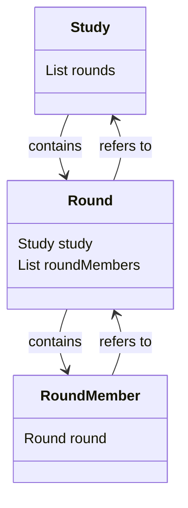
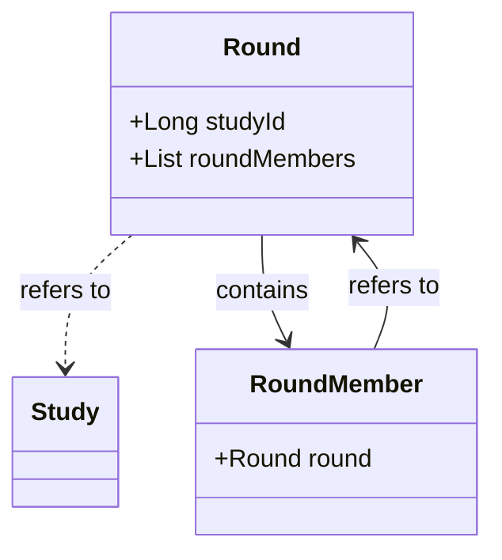

**의존성 정리 전 클래스 구조**


**의존성 정리 후 클래스 구조**



### 스케쥴링 로직

스케쥴링 기능의 대략적인 기능은 다음과 같습니다.
1. 오늘 종료되는 Round(스터디의 한 회차)를 'FINISHED' 상태로 바꾼다.
2. 바로 다음 Round를 'IN PROGRESS' 상태로 바꾼다.
3. 필요하다면 다음 주의 Round들을 미리 생성한다.

이 로직을 수행하던 기존 코드는 다음과 같습니다.
```java
List<Study> studies = studyRepository.findAllByProcessingStatus(ProcessingStatus.IN_PROGRESS);

studies.stream()
	   .filter(study -> study.isCurrentRoundEndAt(today))
	   .forEach(Study::proceedNextRound)
```

코드만 보면 굉장히 깔끔하고 별 문제 없어보입니다.
하지만 기존에는 Study가 Round를 OneToMany로 가지고 있고, Round도 RoundMember를 OneToMany로 가지고 있어, 스터디가 조금만 늘어나도 lazy loading으로 말도 안되는 수의 쿼리가 수행되었습니다.

이를 fetch join으로 해결하기엔 collection 두 개를 fetch해오는 데서 제약이 있었고, eager loading을 사용하면 다른 기능의 성능이 예상치 못하게 저하될 수도 있다는 제약이 있었습니다.

그렇지만 이번에 Round를 Study로부터 분리해내면서, 핵심 기능인 스케쥴링 기능 또한 최적화 할 수 있게 되었습니다.

먼저 1번 로직(현재 라운드 종료)을 위해 오늘 종료되는 Round를 찾아야했습니다.

기존에는 상태가 'Processing' 인 Study 를 찾아와 서버에서 필터링했지만, Round 안에 요일이 있었기 때문에 이를 활용해 데이터베이스에서 필터링 후 찾아올 수 있었습니다.

기존 메서드와 수정한 메서드는 다음과 같습니다. Spring Data JPA를 사용하였기에 Repository 인터페이스에 별도의 메서드 본문은 작성하지 않았습니다.

```java
// 기존 메서드 
List<Study> studies = studyRepository.findAllByProcessingStatus(ProcessingStatus.PROCESSING);

// 수정 후 메서드 
List<Round> rounds = roundRepository.findByRoundStatusAndDayOfWeek(  
    RoundStatus.IN_PROGRESS,  
    today.getDayOfWeek()  // today -> LocalDate.now();
);

```

2번 로직(다음 라운드 진행), 3번 로직을 위해서는 이번 주차, 다음 주차의 Round가 전부 필요했습니다. 다음과 같은 제약, 조건이 있었기 때문입니다.

- 다음 Round를 찾으려면 같은 study_id(FK)를 가진 Round 중 id가 현재 Round 보다 바로 다음으로 큰 Round를 찾아야 함.
	- auto_increment id에 의지하는 문제, 쿼리가 복잡해지는 문제가 발생할 수 있음
- 각 Round 가 자신의 요일만 가지고 있으며, 다른 Round가 어떤 요일에 진행되는지는 알지 못함.
	- 현재 우리 팀의 규칙 상, 이번 주 Round가 전부 종료되어 다음 주로 Round가 이동했을 때, 그 다음 주의 Round를 전부 만들어주어야 했기에, 해당 스터디에 속한 Round의 모든 요일이 필요.

이 조건들을 지키며 재구성한 전체 로직은 다음과 같습니다.

1. 오늘 종료되는 Round를 전부 조회한다.
	1. **조회** 쿼리 1번 발생 -> 1
2. 해당 Round와 같은 studyId를 갖는, 이번 주차와 다음 주차의 Round를 전부 조회한다.
	1. 1번에서 조회된 Round 수 만큼 **조회** 쿼리 발생  -> N
3. 바로 다음 Round를 찾는다.
4. 이번 Round를 종료시키고 다음 Round를 진행시킨다.
	1. 1번에서 조회된 `Round 수 * 2 `만큼 **수정** 쿼리 발생 -> 2N
5. 만약 이번 Round와 종료된 Round의 주차(weekNumber)가 다르다면, 이번 주차에 해당하는 Round를 전부 복사하고, 주차만 수정하여 모든 요일의 Round가 만들어질 수 있게 한다.
	1. 복사시 정보 조회를 위해 Round에 참여하는 멤버들 수(2 ~ 8) * 1번에서 조회된 Round 수 만큼 lazy loading으로 인한 **조회** 쿼리 발생 -> 최대 8N
	2. Round 생성시 1주당 진행하는 Round 수(1 ~ 7) * 1번에서 조회된 Round 수 만큼 **삽입** 쿼리 발생 -> 최대 7N
	3. RoundMember 생성시 1주당 진행하는 Round 수 (1~7) * Round에 참여하는 멤버들 수(2 ~ 8) * 1번에서 조회된 Round 수 만큼 **삽입** 쿼리 발생 -> 최대 56N 

전부 합쳐 최대 74N + 1 개의 쿼리가 발생했습니다.

먼저 가장 간단해보이는 5-1번 쿼리(lazy loading으로 인한 N+1 쿼리)를 해결하기 위해 Round를 조회할 때 RoundMember를 함께 조회해오도록 하였습니다.
Round를 사용하는 모든 곳에서 RoundMember가 필요한 것은 아니었기 때문에 eager loading대신 EntityGraph를 사용하였습니다.

```java
List<Round> nextWeekRounds = createNextRounds(upcomingCandidates);
```

```java
@EntityGraph(attributePaths = "RoundMember")  
List<Round> findByStudyIdInAndRoundStatus(Collection<Long> studyId, RoundStatus roundStatus);
```

이를 통해 7N개의 조회쿼리를 줄일 수 있었습니다.


다음으로 65N개의 삽입과 수정 쿼리가 따로따로 나가는 문제는 batch insert, batch update로 해결하면 좋겠다는 결론을 내렸습니다. 

로직을 수정해 Round 생성 규칙과 주기를 바꾼다거나 하는 방법도 있었지만, 클라이언트 측의 수정이 동반되어야하기에 채택하지 않았습니다.

Insert같은 경우 jdbcTemplate을 사용한 별도의 batchRepository를 구현하여 수행할 수 있었습니다.
그렇지만, Jpa의 더티 체킹을 활용한 update의 경우에는 엔티티를 detach 해주어야하는 귀찮음도 있고, 또 updateAll 같은 메서드가 repository에 있는 것도 어색하다고 생각하여 JPA의 batch_size 기능을 사용하기로 했습니다.

```java
spring:  
  jpa:  
    properties:  
      hibernate:  
        jdbc:  
          batch_size: 500    
```

이를 위해 삽입되는 엔티티의 Id 생성 전략도 TABLE 전략으로 바꿔주었습니다.

id의 allocation size가 기본값(50) 일 때, 700개의 Round를 삽입하기 위해 id 채번을 14번 수행해야했습니다.
이 과정에서 (Id읽기 1번, 반영 쿼리 1번) 각 채번 작업 당 2번의 쿼리가 발생하여 총 28개의 쿼리가 발생했습니다.

이 수를 줄이기 위해 allocationSize 또한 batch_size와 동일한 500으로 설정하였습니다.

```java
  
@GeneratedValue(strategy = GenerationType.TABLE, generator = "sequence_generator")  
@TableGenerator(name = "sequence_generator", table = "round_sequence",  
    pkColumnName = "sequence_name", pkColumnValue = "id",  
    initialValue = 1, allocationSize=500)  
@Id  
private Long id;
```


지금까지 설명한 과정을 반영해 작성된 스케쥴링 로직의 전체 코드는 다음과 같습니다.

```java
// 오늘 종료되는 라운드 전부 조회
List<Round> rounds = roundRepository.findByRoundStatusAndDayOfWeek(  
        RoundStatus.IN_PROGRESS,  
        today.getDayOfWeek()  
);

for (Round round : rounds) {  

    // 이번 주차와 다음 주차 Round 전부 조회
    List<Round> upcomingCandidates = roundRepository.findByStudyIdAndWeekNumberIn(  
            round.getStudyId(),   
            List.of(currentWeek, currentWeek + 1)  
    );  

	// 바로 다음 Round 조회
    Round upcomingRound = findUpcomingtRound(upcomingCandidates);
                                                      
	// round 교대(상태 변경)
	// 반복이 끝나고 batch update를 위해 별도의 컬렉션에 추가
	willBeFinished.add(round);  
	willProgress.add(upcomingRound);
    

	// 만약 한 주의 모든 Round가 끝났다면, 그 다음주의 Round 생성
    if (!upcomingRound.isSameWeek(currentWeek)) {  
        List<Round> nextWeekRounds = upcomingCandidates.stream()  
                                                       .filter(candidate -> candidate.isSameWeek(currentWeek + 1))  
                                                       .map(Round::createNextWeekRound)  
                                                       .toList();  
	    // 반복이 끝나고 batch insert를 위해 별도의 collection에 추가
        nextWeekRoundsAll.addAll(nextWeekRounds);  
  
    }  
}
```

그런데 예상과는 다르게 batch update로직이 똑바로 수행되지 않는 것을 확인할 수 있었습니다.

이는 매 반복마다 roundRepository 의 find 메서드를 호출하기 때문에 db와 통신할 때, 쓰기 지연 저장소에 있는 엔티티들이 flush되기 때문에 발생하는 일이었습니다.

```java
    List<Round> upcomingCandidates = roundRepository.findByStudyIdAndWeekNumberIn(  
            round.getStudyId(),   
            List.of(currentWeek, currentWeek + 1)  
    );  
```

결국, 반복마다 실행되는 조회 쿼리도 함께 줄이기 위해 이 부분을 개선하기로 결정했습니다.

개선 작업에 대한 힌트는 우리 서비스의 규칙에서 찾을 수 있었습니다.

*> 이번 주 Round가 전부 종료되어 다음 주로 Round가 이동했을 때, 그 다음 주의 Round를 전부 만들어주어야 한다.* 

이 규칙은 ***'종료되지 않은 Round는 모두 이번 주와 다음 주 Round 이다'*** 라고도 해석할 수 있습니다.

이를 통해 전체 로직을 다음과 같이 수정할 수 있었습니다.

```java
// 오늘 종료되는 Round 에서 studyId를 추출하고, 끝나지 않은 Round를 전부 조회
List<Round> rounds = roundRepository.findByRoundStatusAndDayOfWeek(  
        RoundStatus.IN_PROGRESS,  
        today.getDayOfWeek()  
);
List<Long> studyIds = rounds.stream()  
                            .map(Round::getStudyId)  
                            .toList();
                            
// studyId로 Grouping함.
Map<Long, List<Round>> notStartedRounds = roundRepository.findByStudyIdInAndRoundStatus(studyIds, RoundStatus.NOT_STARTED)  
                                                         .stream()  
                                                         .collect(Collectors.groupingBy(Round::getStudyId));  

// 반복문이 끝나고 batch update, batch insert를 수행하기 위한 임시 컬렉션
List<Round> nextWeekRoundsAll = new ArrayList<>();  
List<Round> willBeFinished = new ArrayList<>();  
List<Round> willProgress = new ArrayList<>();  

// 오늘 종료되는 Round를 하나씩 순회
for (Round round : rounds) {  
    Integer currentWeek = round.getWeekNumber();  
    // studyId로 해당 Round와 같은Study의 종료되지 않은 Round의 리스트 조회
    List<Round> upcomingCandidates = notStartedRounds.get(round.getStudyId());  
  
	Round upcomingRound = findUpcomingRound(upcomingCandidates);
	
    willBeFinished.add(round);  
    willProgress.add(upcomingRound);  
  
    if (!upcomingRound.isSameWeek(currentWeek)) {  
        List<Round> nextWeekRounds = createNextRounds(upcomingCandidates);
        nextWeekRoundsAll.addAll(nextWeekRounds);  
    }  
}  

// update 수행
willBeFinished.forEach(Round::finish);  
willProgress.forEach(Round::proceed);  

// batch insert 수행
roundRepository.saveAll(nextWeekRoundsAll);

```


Study - 100개
Round 진행 요일 - 월화수목금토일
참여인원 - 8명 

위 기준으로 테스트 코드를 작성해 측정한 지표는 다음과 같습니다.

```
// 기존 로직으로 측정
// 새로운 Round가 생성되지 않을 때는 약 초, 생성 될때는 약 0.1초 걸림

time spent to proceed Round 
study size: 100
total time spent: 3537
The JVM is using 92 MB of memory.

time spent to proceed Round 
study size: 100
total time spent: 5429
The JVM is using 193 MB of memory.

```

```
// 변경된 로직으로 측정
// 새로운 Round가 생성되지 않을 때는 약 0.05초, 생성 될때는 약 0.1초 걸림

time spent to proceed Round 
study size: 100
total time spent: 115
The JVM is using 174 MB of memory.

time spent to proceed Round 
study size: 100
total time spent: 51
The JVM is using 198 MB of memory.

time spent to proceed Round 
study size: 100
total time spent: 45
The JVM is using 121 MB of memory.

time spent to proceed Round 
study size: 100
total time spent: 138
The JVM is using 143 MB of memory.
```

수행되는 쿼리의 개수는 7301개에서 8개로 약 99.8% 감소했고,
수행 시간은 5.4초에서 0.1초로 약 98% 감소했습니다.

사실 이 개선 작업은 코드를 처음부터 다시 작성하는 게 아니면 불가능하다고 느껴지는 작업이었습니다.
계속해서 기능이 추가되고 수정되는 중, 엔티티간의 연관 관계를 수정하기가 굉장히 까다로웠기 때문인데, 우연히 참가한 우아콘에서 점진적 모듈 분리에 대한 발표를 듣고 이를 해결 할 아이디어를 얻었던 게 지금 생각해보면 굉장한 행운이었습니다.

역시 다른 사람들의 경험을 듣는 건 큰 공부가 되는 것 같습니다.👍

