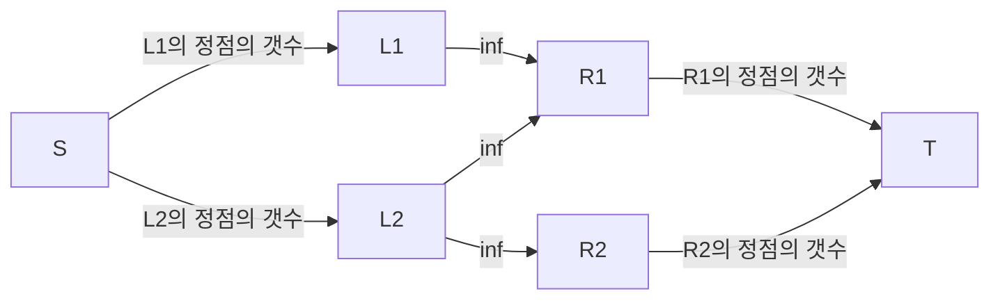

알고리즘 문제를 풀다가 만난 쾨닉의 정리가 도저히 직관으로는 이해가 안됐다. 그래서 증명을 찾아보다가 한 알고리즘 + cs 블로그에 잘 정리된 글을 찾았다.

https://gazelle-and-cs.tistory.com/category

여러가지 그래프 이론들이 정리가 굉장히 잘 되어 있는데도 플로우 네트워크와 홀의 정리에서 사용되는 그래프 용어들, 보조 정리들이 하나도 기억이 안나서 전공책을 다시 뒤적이면서 처음부터 공부했다. 다시 잊어버리더라도 내가 쓴 글은 잘 이해되길 바라며 이를 기록해본다.

### Matching

어떤 그래프 $G = (V, E)$ 에서 $G$ 안의 간선들의 부분집합 $M$ 이 어떤 정점도 공유하고 있지 않을 때, 이 $M$을 **Matching** 이라고 한다.

### Vertex Cover

어떤 그래프 $G = (V, E)$ 에서 $G$ 안의 정점들의 부분집합 $U$에 대해, 그래프 $G$의 모든 간선의 한개 이상의 끝 점이 $U$에 속한다면 $U$를 **Vertex Cover** 라고 부른다.

### Vertex Cover와 Matching의 관계

Matching 의 정의에 **어떤 Vertex Cover $U$에 속한 정점 하나가 처리할 수 있는 Matching $M$의 간선은 최대 1개다.**

즉, 어떤 그래프 $G$ 에서 이 그래프에 대한 **Vertex Cover $U$에 대해 이 그래프 안에서 찾을 수 있는 어떠한 Matching $M$의 크기도 $U$의 크기보다 클 수 없다.**

즉, $|M| ≤ |U|$ 이다.

이를 통해 우리는 어떤 크기가 같은 $M$ 과 $U$ 가 있다면, $M$은 그래프의 **Maximum Matching**이며, $U$는 그래프의 **Minimum Vertex Cover** 라는 것을 알 수 있다.

잘 알려져있듯 어떤 그래프에서 Minimum Vertex Cover를 찾는 문제는 NP-hard 이다. 그런데 신기하게도 Maximum Matching을 찾는 문제는 아니다. Blossom algorithm으로 다항시간에 해결이 가능하다.

Vertex Cover와 Matching 사이에 연관이 있음이 자명함에도 어떤 문제는 NP-hard이고, 어떤 문제는 아닌 게 신기하다…

물론, 모든 그래프가 크기가 같은 Maximum Matching과 Minimum Vertex Cover를 갖지 않기에 항상 다항시간에 Minumum Vertex Cover를 구할 수 있지는 않다.

그렇지만 이분 그래프에서는 밑의 정리에 의해 Minimum Vertex를 다항시간에 찾을 수 있다!

### 쾨닉의 정리

: 모든 이분 그래프에서 maximum matching 의 크기와 minimum vertex cover의 크기는 동일하다.

다음과 같은 플로우 네트워크가 있다고 하자.

(여기서 $L1, L2, R1, R2$ 는 모두 정점의 집합이다. 그리고 그래프에서 볼 수 있듯, 이는 $L1 \cup L2$  에서 $R1 \cup R2$ 로 향하는 최대 매칭을 찾는 문제를 최대 유량문제로 변환한 형태이다.)

정점의 관계는 다음과 같이 표현할 수 있다.

1. $L1$의 정점은 모두 $R1$ 에 인접한다.(간선이 전부 R1만을 향하므로)
2. $R2$의 정점은 모두 $L2$ 에 인접한다.(간선이 전부 L2에서 들어오므로)

그리고 플로우 네트워크에서 minimum cut 의 크기는 maximum matching과 동일하다.

위 그래프에서 $|L1| > |L2|$ & $|R1| < |R2|$ 라면 minimum cut이 $S, L1 , R1$ 과 $L2 , R2, T$ 로 나누는 절단이라는 사실은 쉽게 알 수 있다. (의심되면 절단이 몇 개 없으니 직접 해봐도 된다ㅋㅋㅋ..)

이 때, 당연히 minimum cut의 크기는 $|L2| + |R1|$ 이다. 즉, maximum matching의 크기는 $|L2| + |R1|$ 이라고 할 수 있다.

이제 vertex cover를 찾아보자.

$L1$의 정점은 전부 $R1$의 어떤 정점 부분집합에 대해 인접하고, $R2$의 정점은 전부 $L2$의 어떤 정점 부분집합에 대해 인접하다.

즉, $R1$과 $L2$ 의 정점들을 모두 선택하면 그래프의 vertex cover가 되고 이 때 크기는 $|R1| + |L2|$ 이다!

위 vertex cover와 matching의 관계에서 설명했듯, 둘의 크기가 같으면 이는 maximum matching 이고, minumum vertex cover 이다.

### 마무리

알고리즘 증명을 공부하는 건 확실히 재밌다. 뭔가 눈이 뜨이는 느낌? 그런데 시간이 너무 오래걸린다…ㅋㅋㅋ 

미션을 오늘 제출했고, 내일은 주말이라 디비 스터디도 없어서 각잡고 증명을 공부할 수 있었다.

이제부터는 시간이 날 때마다 그냥 넘어갔던 이론들에 대해 증명들을 정리해보려고 한다. 그럼 더 잘 기억나겠지.. 화이팅!
아마 다음 포스팅은 eertree가 되지 않을까

추가로 수식 쓰는거 궁금하신 분들은 [Tex문법](https://ko.wikipedia.org/wiki/%EC%9C%84%ED%82%A4%EB%B0%B1%EA%B3%BC:TeX_%EB%AC%B8%EB%B2%95) 참고 해보시길! 
꽤나 간단하게 여러 수식을 쓸 수 있음!